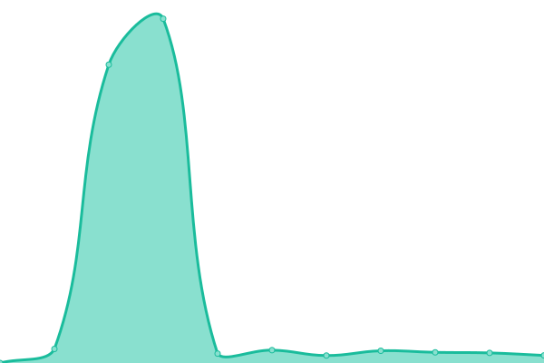
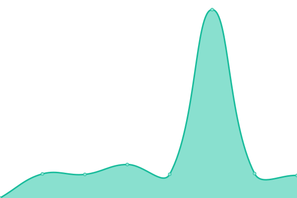
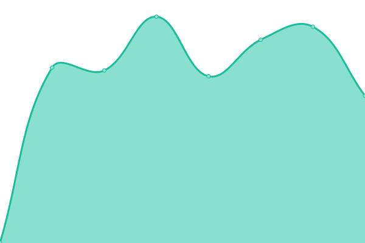
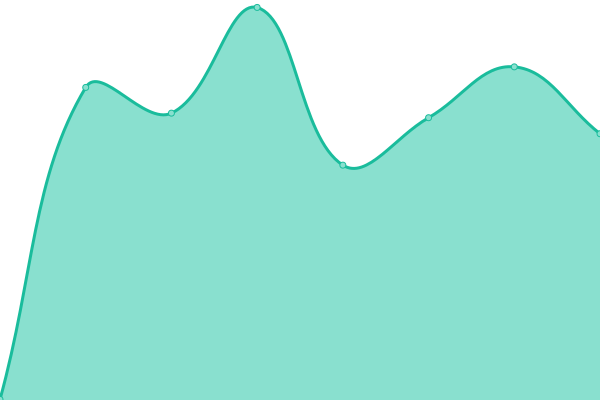
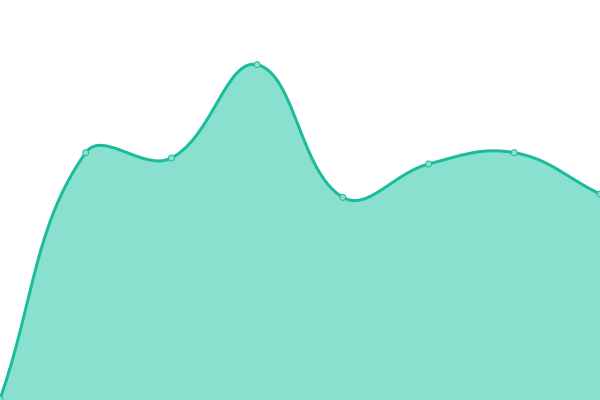

# [📈 Live Status](https://status.boerman.dev): <!--live status--> **🟩 All systems operational**

This repository contains the open-source uptime monitor and status page for [fboerman](https://boerman.dev/), powered by [Upptime](https://github.com/upptime/upptime).

With [Upptime](https://upptime.js.org), you can get your own unlimited and free uptime monitor and status page, powered entirely by a GitHub repository. We use [Issues](https://github.com/fboerman/monitoring/issues) as incident reports, [Actions](https://github.com/fboerman/monitoring/actions) as uptime monitors, and [Pages](https://status.boerman.dev) for the status page.

<!--start: status pages-->
<!-- This summary is generated by Upptime (https://github.com/upptime/upptime) -->
<!-- Do not edit this manually, your changes will be overwritten -->
<!-- prettier-ignore -->
| URL | Status | History | Response Time | Uptime |
| --- | ------ | ------- | ------------- | ------ |
|  [Grafana Dashboards](https://data.boerman.dev) | 🟩 Up | [grafana-dashboards.yml](https://github.com/fboerman/monitoring/commits/HEAD/history/grafana-dashboards.yml) | 

 677ms
     
 | 

<a href="https://status.boerman.dev/history/grafana-dashboards">99.71%</a>
    

|  [Blog](https://boerman.dev) | 🟩 Up | [blog.yml](https://github.com/fboerman/monitoring/commits/HEAD/history/blog.yml) | 

 564ms
     
 | 

<a href="https://status.boerman.dev/history/blog">99.71%</a>
    

|  [Day-Ahead Reports](https://reports.coreflowbased.eu/members/) | 🟩 Up | [day-ahead-reports.yml](https://github.com/fboerman/monitoring/commits/HEAD/history/day-ahead-reports.yml) | 

 556ms
     
 | 

<a href="https://status.boerman.dev/history/day-ahead-reports">99.84%</a>
    

|  [Flowbased domain calculators](https://coreflowbased.eu/calculators/) | 🟩 Up | [flowbased-domain-calculators.yml](https://github.com/fboerman/monitoring/commits/HEAD/history/flowbased-domain-calculators.yml) | 

 527ms
     
 | 

<a href="https://status.boerman.dev/history/flowbased-domain-calculators">98.66%</a>
    

|  [EU Flow viewer](https://flows.boerman.dev/) | 🟩 Up | [eu-flow-viewer.yml](https://github.com/fboerman/monitoring/commits/HEAD/history/eu-flow-viewer.yml) | 

 478ms
     
 | 

<a href="https://status.boerman.dev/history/eu-flow-viewer">99.80%</a>
    

|  [CORE Status Page](https://status.coreflowbased.eu) | 🟩 Up | [core-status-page.yml](https://github.com/fboerman/monitoring/commits/HEAD/history/core-status-page.yml) | 

 542ms
     
 | 

<a href="https://status.boerman.dev/history/core-status-page">98.92%</a>
    

|  [Amunanalytics Kratos](https://kratos.coreflowbased.eu/health/alive) | 🟩 Up | [amunanalytics-kratos.yml](https://github.com/fboerman/monitoring/commits/HEAD/history/amunanalytics-kratos.yml) | 

 449ms
     
 | 

<a href="https://status.boerman.dev/history/amunanalytics-kratos">99.95%</a>
    

<!--end: status pages-->

[**Visit our status website →**](https://status.boerman.dev)

## 📄 License

- Powered by: [Upptime](https://github.com/upptime/upptime)
- Code: [MIT](./LICENSE) © [Anand Chowdhary](https://anandchowdhary.com), supported by [Pabio](https://pabio.com)
- Data in the `./history` directory: [Open Database License](https://opendatacommons.org/licenses/odbl/1-0/)
